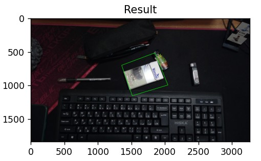

# 🔍 شناسایی اشیا با SIFT و FLANN 🚀

## 📌 معرفی پروژه
در این پروژه، از الگوریتم **SIFT (Scale-Invariant Feature Transform)** برای استخراج ویژگی‌های تصویر و از **FLANN-based Matcher** برای تطبیق ویژگی‌ها استفاده شده است. هدف این پروژه، یافتن یک شیء مشخص در یک تصویر دیگر با استفاده از تشخیص ویژگی‌های کلیدی و همولوگرافی است.

---

## 🎯 ویژگی‌های پروژه
✅ استفاده از **SIFT** برای استخراج ویژگی‌های پایدار از تصاویر 🔬  
✅ تطبیق ویژگی‌ها با استفاده از **FLANN-based Matcher** 🔗  
✅ اعمال **Homography Transformation** برای تعیین موقعیت شیء در تصویر دوم 📍  
✅ نمایش نتیجه تشخیص در کنار تصاویر ورودی 🖼️

---

## ⚙️ نحوه استفاده
### 1️⃣ نصب پیش‌نیازها
ابتدا کتابخانه‌های مورد نیاز را نصب کنید:
```bash
pip install numpy opencv-python matplotlib
```

### 2️⃣ اجرای کد
برای اجرای کد، تصاویر مورد نظر خود را در مسیر `images/` قرار داده و سپس اسکریپت را اجرا کنید:
```bash
python detect_object.py
```

---

## 📥 ورودی و 📤 خروجی
🔹 **ورودی:** دو تصویر، یکی به عنوان تصویر مرجع (**Query Image**) و دیگری به عنوان تصویر هدف (**Train Image**)  
🔹 **خروجی:** تصویر هدف که شیء مورد نظر با یک کادر سبز مشخص شده است ✅

---

## 🖼️ مثال از عملکرد پروژه
**تصویر ورودی:**
| 🎯 Query Image | 🎯 Train Image |
|-------------|-------------|
|  |  |

**🔍 نتیجه تشخیص:**


---

## 🔗 لینک پروژه
📌 [مشاهده در گیت‌هاب](https://github.com/pooyaHajiSadeghi/sift-object-detection)
